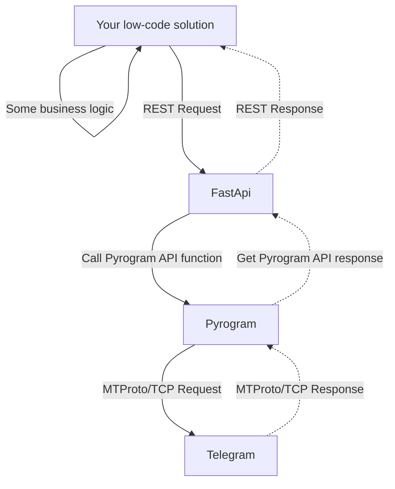

# FastAPI Telegram Backend
 A FastAPI with Pyrogram backend built to provide a RESTful API for managing Telegram groups for using low-code software (N8N).



### The API allows you to perform actions like:

- Creating Supergroups: Create new Telegram supergroups with customizable titles and descriptions.
- Adding Members: Add new users to existing groups.
- Banning Members: Remove members from a group, including the ability to set ban durations.
- Sending Messages: Send direct messages to users.
- Adding Contacts: Add users to your contact list.
- Promoting Members: Grant administrative privileges to users in a group with fine-grained control over permissions.
- Authentication: Uses API key authentication to secure access to the API.
- Setting group avatar
- Getting group users
  and more!

### Features:
- RESTful API
- Swagger UI
- Error Handling: Robust error handling for common Telegram API exceptions.
- Authentication: Uses Bearer Token authentication to secure your backend.
- Asynchronous Design: Built with asynchronous programming for efficient handling of multiple requests.

### Getting Started:
Create venv and install dependencies:
```
python -m FastAPIuserbot /path/to/new/virtual/environment
source <venv>/bin/activate
pip install -r requirements.txt
```       

Set up credentials:
- Create a .env file in the root directory.
- Fill in your Telegram API ID, API Hash, Telegram phone number and Bearer Token token.

### Run the application:

```      
uvicorn main:app --reload
```
You will be promted to enter OTP from telegram.
The new sesion will be saved in your root directory under the name `mysession.session` (you can change the name in main.py)

### Todo:
- Refactoring
- More endpoints
### Contributing:

Contributions are welcome! Feel free to submit pull requests for bug fixes, feature enhancements, or documentation improvements.

### License:

This project is licensed under the GPL 3.0 License.  
Copyright (C) 2024 Aleksei Dertev
